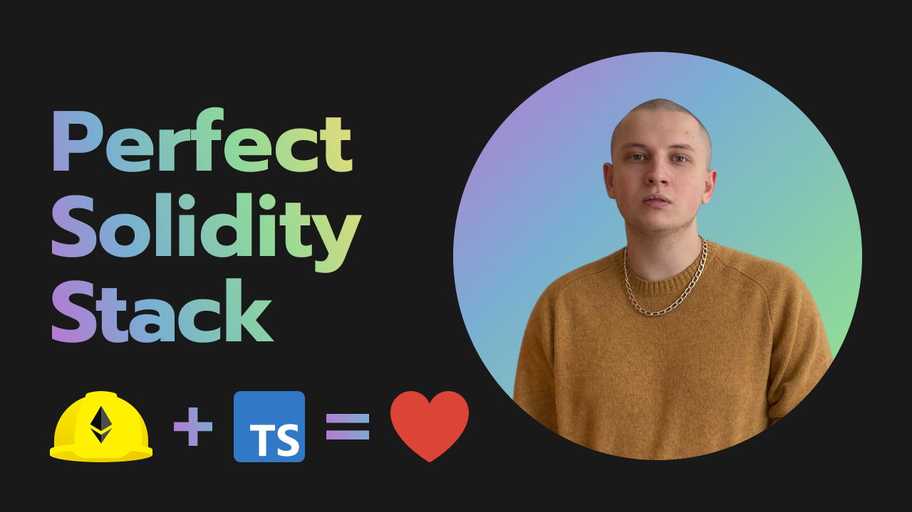
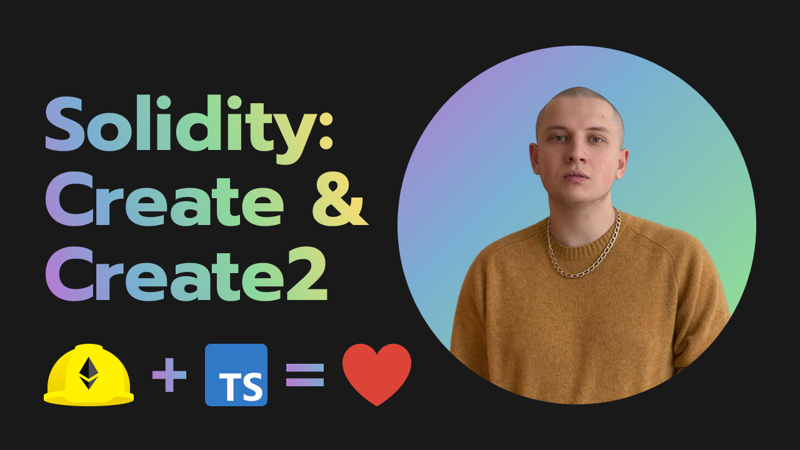
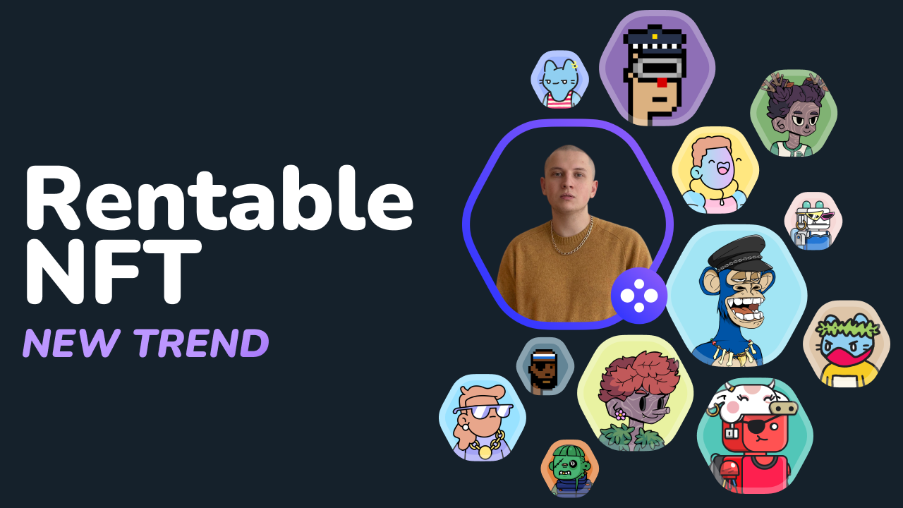
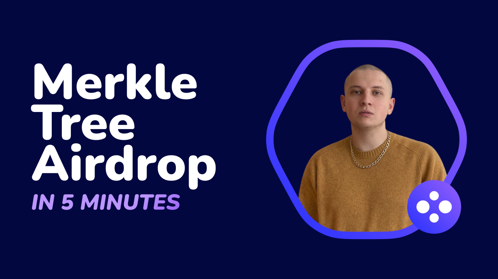

# Code in Solidity like a PRO with Egor Gavrilov

## Check out YouTube channel [youtube.com/EgorGavrilov](https://youtube.com/EgorGavrilov)

### Tutorials

1. [Perfect Solidity Stack](https://youtu.be/NohOI4HWYCs)

It's easy to get started with Solidity programming, but how do you approach it professionally? We figure it out in this video. 

2. [Predict Contract Address](https://youtu.be/A27p0qfpcAc)

Deploy your Smart Contract with a precomputed address. We will write a Solidity Smart Contract with two options: using Create and Create2.

3. [Rentable NFT](https://youtu.be/DG2lNEMI1TQ)

Rentable NFTs are the next big trend. Rent out an expensive NFT for one day and take advantage of all the benefits for a small fee.

4. [Merkle Tree Airdrop](https://youtu.be/XhzkwB71IJE)

Use Merkle tree to airdrop your token in a cheap, elegant and efficient way. 

